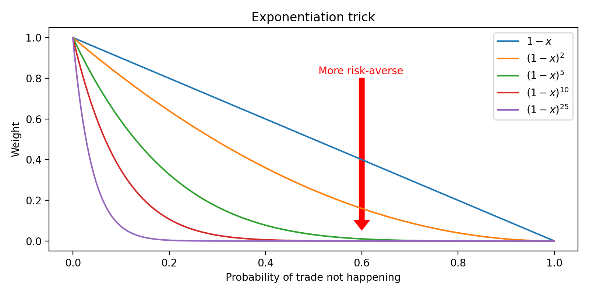

# Optimal Transport problem 🚚 — G-Research Quant Finance Challenge 📊 at ETH Zurich 🇨🇭

Code for the **first place solution** of the **Optimal Transport** problem at the **G-Research Quant Finance Challenge** at ETH Zurich on October 10, 2023. Thanks to my amazing teammates and G-Research!

## Solution Overview

Given the short time, this is just a more optimized version of a greedy algorithm, using the probability exponentiation trick plus randomization.

In summary:
- For every city, look at all available trades and weigh the profit by exponentiating the probability of the trade occurring (to account for risk).
- While there is supply and demand, build the transportation plan by selling in order of the computed risk-aware profit measure to maximize gain.
- Calculate the expected profit using the real probability that the trade will occur.
- Repeat for various permutations and return the best strategy on average.

Below are the official instructions given during the contest.

## Problem Statement

You are a commodities trader who aims to make a profit by transporting commodities between cities. There are N cities and a single commodity being traded.

You are given a graph G represented as an NxN array that shows the per-unit transportation costs between cities.

For city A and city B, the entry G[A, B] represents the per-unit cost to move commodities from city A to B. Note that the cost to move from city A to city B is not necessarily equal to the cost to move from city B to city A.

The transportation routes between cities can be closed due to weather conditions, and array P of size NxN provides the probability that the routes between cities are closed. For city A and city B, the entry P[A, B] represents the probability the route between cities A and B is closed. When the routes are closed, there will be no profit or loss made from that route.

The demand and supply of the commodity in each city varies. Array C of size Nx4 lists the market information of each city, namely the buying price, the selling price, the maximum demand and the maximum supply of the commodity.

You are required to provide a transportation plan that will move commodities between cities at once to obtain a profit. A transportation plan is a list of instructions where each instruction represents the quantity of the commodity to be moved from one city to another. All the instructions will be carried out at the same time. The transportation plan needs to satisfy the overall demand and supply constraints of each city. It is not possible to transport commodities through multiple cities.

## Computational Constraints

Number of cities N is an integer between 100 and 500.
City information C is an array of size Nx4, where each row represents the buying price, selling price, maximum demand size, maximum supply size of that city.
Transportation costs G is an array of size NxN of floats greater or equal to 0.
Failure probability P is an array of size NxN of floats between 0 and 1.

## Inputs and Outputs

### Inputs:

City information C: Array[N,4]. A table listing the price and amount of commodities that a city wants to buy or sell. Example row: (99, 101, 100, 200), saying the city buys the commodity at a unit price of 99 up to 100 units and sells the commodity at a unit price of 101 up to 200 units.

Transportation costs G: Array[N,N]. A table which represents the cost to move a unit of commodity from one city to another. G[i,j] in the array represents the cost to move a unit of commodity from city i to city j, where i and j are between 0 to N-1.

Failure probability P: Array[N,N]. A table which represents the probability of a route being closed, so the gain loss from that route is set to zero. P[i,j] in the array represents the failure probability of the route from city i to city j, where i and j are between 0 and N-1.

### Output:

Transportation plans: Array[X,3]. A table that describes how many units to move from one city to another. Example row: (0, 1, 500), saying we move 500 units from city 0 to city 1.

All inputs are represented as numpy arrays and the output should also be returned as a numpy array.

## Scoring

For each graph, the score is the total profit or loss made from each trade in the transportation plan. For each trade, the profit is calculated as profit = (selling_price - buying_price - transportation_cost) * quantity if the transportation route is not closed.

The score displayed on the leaderboard is normalised to a scale between 0 to 1 with respect to total profit obtained by the benchmark solution.

## Test Structure and Time Limits

- There are 5 tests and the final score is an average across these 5 tests.
- The time limit is 30 seconds per test.
- There are exactly 20 graphs in each test and the score of each test is the sum of the scores for each of the graphs.
- All graphs are generated randomly.
- Python packages allowed in the challenge are numpy, pandas and scipy.
